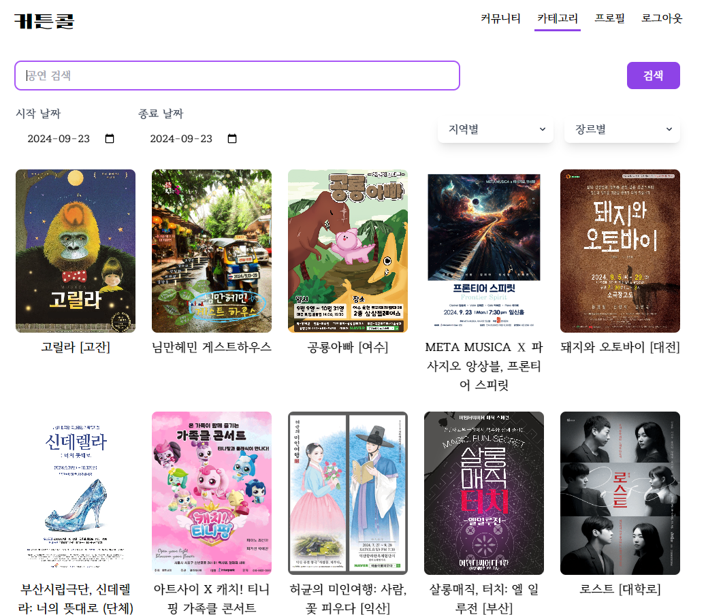

# 커튼콜 🎭 [outsourcing-project]

[메인페이지] 

[상세페이지] 

[커뮤니티 페이지]

[카테고리 페이지] 

---

## 팀 소개

[내일배움캠프] 5진스

## 👨‍🏫 프로젝트 소개

## 공연을 공유하고 검색할 수 있는 페이지

## 🚩 프로젝트 개요

- **프로젝트명** &nbsp; :&nbsp; **커튼콜**
- **진행 기간** &nbsp;: &nbsp; **24.09.11 ~ 24.09.23**

---

## 👨‍👩‍👧‍👦 팀원 소개

|   정소현   |      강다연      |        류지원        |  박규리  |         조해인         |
| :--------: | :--------------: | :------------------: | :------: | :--------------------: |
|  **팀원**  |     **팀원**     |       **팀장**       | **팀원** |        **팀원**        |
| 상세페이지 | 로그인, 회원가입 | 카테고리, 헤더, 푸터 | 커뮤니티 | 메인페이지, 헤더, 푸터 |

---

## 📚 STACKS

<div align=Left>


</div>

---

## 설치 패키지

- 프로젝트 세팅 : yarn create vite --template react
  - 실행 : yarn dev
- json-server 설치 : yarn add json-server
  - 실행 : yarn json-server db.json --port 4000
- tanstack query 설치 : yarn add @tanstack/react-query @tanstack/react-query-devtools
- axios 설치 : yarn add axios
- tailwind css 설치 : yarn add -D tailwindcss postcss autoprefixer
  - tailwind.config.js 파일 생성 : npx tailwindcss init -p
- react-router-dom 설치 : yarn add react-router-dom
- zustand 설치 : yarn add zustand
- styled-component 설치 : yarn add styled-component
- embla(캐러셀 라이브러리) : yarn add embla-carousel-react embal-carousel-autoplay
- the-new-css-reset 설치 : yarn add the-new-css-reset

---

## ✔️ Code Convention

- ES Lint , prettier 사용
- 컴포넌트일 경우에만 .jsx확장자 사용
- customHook을 사용하는 경우 : use + 함수명
- Props의 경우: on (onClick 등등)
- 함수인 경우: handle (handleClick 등등)
- 상수 : 모두 대문자 스네이크 케이스(snake_case) 예시) SNAKE_CASE
- js(변수, 함수, 인스턴스) : 카멜 케이스(camelCase) 예시) const createMovie = [];
- css, html : 케밥 케이스(kebab-case) 예시) `<div class="movie-items"></div>`
- image 명 : 케밥 케이스(kebab-case) 예시) movie-img.jpg
- 주석 최대한 활용하기 : 해당 코드 제목, 설명 간단하게 적어놓기
- 약칭은 되도록 사용하지 않기

## ✔️ Git Commit Convention

작업 타입 작업내용

- update : 해당 파일에 새로운 기능이 생김
- add : 없던 파일을 생성함, 초기 세팅
- bugfix : 버그 수정
- refactor : 코드 리팩토링
- fix : 코드 수정
- move : 파일 옮김/정리
- del : 기능/파일을 삭제
- test : 테스트 코드를 작성
- style : css
- gitfix : gitignore 수정
- script : package.json 변경(npm 설치 등)

## 🗂️ 기능 설명

#### 메인 페이지

---

#### 상세 페이지

- 공연 세부 안내 사항
- 공연 장소 (카카오 지도 조회 가능)
- 공연 댓글 조회
- 공연 댓글 작성 및 삭제

1. 공연 api연결 + tanstackQuery data저장

```jsx
// detailApi.js
// 공연 상세 데이터를 가져오는 함수
export const fetchDetailData = async (id) => {
  const url = `http://kopis.or.kr/openApi/restful/pblprfr/${id}?service=${apiKey}`;

  try {
    const response = await axios.get(url);
    const jsonData = parseXMLToJSON(response.data);
    console.log(jsonData); // 변환된 JSON 데이터 콘솔 출력
    return jsonData;
  } catch (error) {
    console.error("DetailDataError", error);
    throw new Error("데이터를 불러오는 중 오류가 발생했습니다.");
  }
};
```

```jsx
const { id } = useParams();

// 공연 상세 정보 불러오기
const {
  data,
  isLoading: detailLoading,
  isError: detailError,
} = useQuery({
  queryKey: ["performanceDetail", id],
  queryFn: () => fetchDetailData(id),
});
const detailData = data?.dbs?.db;

if (detailLoading) {
  return <div>Loading...</div>;
}

if (detailError || !detailData) {
  return <div>Error</div>;
}
```

2. 지도 api연결 + 카카오 map SDK사용

```js
// detailApi.js
// 공연 장소 데이터를 가져오는 함수
export const fetchMapData = async (placeId) => {
  const mapUrl = `http://www.kopis.or.kr/openApi/restful/prfplc/${placeId}?service=${apiKey}`;

  try {
    const response = await axios.get(mapUrl);
    const jsonData = parseXMLToJSON(response.data);
    return jsonData;
  } catch (error) {
    console.error("Map Error", error);
    throw new Error("데이터를 불러오는 중 오류가 발생했습니다.");
  }
};
```

```js
// DetailMap.jsx
import React from "react";
import { useQuery } from "@tanstack/react-query";
import { Map, MapMarker, ZoomControl } from "react-kakao-maps-sdk";
import { fetchMapData } from "../../api/detailApi";

const DetailMap = ({ detailData }) => {
  const placeId = detailData?.mt10id;
  const { data, isLoading, isError } = useQuery({
    queryKey: ["mapData", placeId],
    queryFn: () => fetchMapData(placeId),
    enabled: !!placeId,
  });

  const mapData = data?.dbs?.db;

  if (isLoading) {
    return <div>Loading...</div>;
  }

  if (isError) {
    return <div>Error</div>;
  }

  if (!mapData) {
    return <div>장소 정보가 없습니다.</div>;
  }

  // 좌표값을 숫자로 변환
  const lat = parseFloat(mapData.la);
  const lng = parseFloat(mapData.lo);

  return (
      <Map
        center={{ lat, lng }} // 좌표값을 숫자로 변환하여 설정
        style={{ width: "100%", height: "500px" }}
        level={3}
      >
        <MapMarker position={{ lat, lng }} />
        <ZoomControl />
      </Map>
    </div>
  );
};

export default DetailMap;

```

3. 댓글 작성, 삭제 + db.json활용

```js
// detailApi.js
// 상세페이지 댓글 작성 기능
const jsonUrl = import.meta.env.VITE_DB_URL + "/comments";
const commentApi = axios.create({ baseURL: jsonUrl });

// 댓글 추가
export const detailAddComment = async (newComment) => {
  const { data } = await commentApi.post("/", newComment);
  return data;
};

// 특정 공연의 댓글 가져오기
export const detailGetComment = async (performanceId) => {
  const { data } = await commentApi.get("/");
  return data.filter((comment) => comment.performanceId === performanceId);
};

// 댓글 삭제
export const detailDeleteComment = async (id) => {
  const { data } = await commentApi.delete(`/${id}`);
  return data;
};
```

```js
// DetailComment.jsx
const addMutation = useMutation({
  mutationFn: (newComment) => detailAddComment({ ...newComment, performanceId: id }),
  onSuccess: () => {
    queryClient.invalidateQueries(["comments", id]);
    setComment("");
  },
});

// 댓글 삭제 mutation
const removeMutation = useMutation({
  mutationFn: detailDeleteComment,
  onSuccess: () => {
    queryClient.invalidateQueries(["comments", id]);
  },
});

// 댓글 가져오기 query
const {
  data: comments = [],
  isLoading,
  isError,
} = useQuery({
  queryKey: ["comments", id],
  queryFn: () => detailGetComment(id),
});
```

---

#### 커뮤니티

---

#### 카테고리

- 필터링 추가
  - 검색
  - 시작날짜/종료날짜
  - 지역별
  - 장르별
- 필터링에 따른 공연 리스트 출력
- 해당 공연 클릭 시 상세 페이지로 이동

1. db.json 서버 사용하여 공연 리스트 출력

```js
import axios from "axios";
import { genreCodes } from "../utils/Kopis-api-common";
import { getDateString, parseXMLToJSON } from "../utils/utils";

// KOPIS 관련
const BASE_URL = "http://kopis.or.kr/openApi/restful/pblprfr";

const playApi = axios.create({ baseURL: BASE_URL });

export const getGenreAreaData = async (genre, area, row, startDate, endDate) => {
  try {
    const { data } = await playApi.get("/", {
      params: {
        service: import.meta.env.VITE_KOPIS_KEY,
        stdate: startDate,
        eddate: endDate,
        rows: row,
        cpage: 1,
        shcate: genre === "장르별" ? null : genre,
        signgucode: area === "지역별" ? null : area,
      },
    });

    const result = parseXMLToJSON(data).dbs;
    if (result) {
      return result.db;
    } else {
      return [];
    }
  } catch (error) {
    console.error("Error fetching performance details:", error);
    throw new Error("데이터를 불러오는 중 오류가 발생했습니다.");
  }
};

export const searchGenreAreaData = async (searchValue, genre, area, row, startDate, endDate) => {
  const allData = await getGenreAreaData(genre, area, row, startDate, endDate);

  const data = allData.filter((data) => {
    return String(data["prfnm"]).includes(searchValue);
  });
  return data;
};
```

---

## 💥 Trouble Shooting

[메인페이지]

---

[상세페이지]

🔥 문제점

1. zustand에서 tanstackQuery로의 코드 리펙토링

- 불필요하게 상세페이지 정보와 지도데이터 정보를 zustand에서 전역상태관리를 하여 data, loading과 error를 useState로 저장하고 useEffect를 활용하여 상태변화가 생길 때마다 렌더링 할 수 있도록 하였는데 tanstackQuery로 리펙토링하여 isLoading, isError, useQuery를 사용하여 보다 편리하게 상태관리를 하였다.

```js
// zustand코드
// useKopisStore.js
import { create } from "zustand";
import { fetchDetailData, fetchMapData } from "../api/detailApi";

const useKopisStore = create((set, get) => ({
  data: null,
  mapData: null,
  error: null,

  // 공연 상세 정보 가져오는 함수
  fetchData: async (id) => {
    try {
      const result = await fetchDetailData(id);
      if (result && result.dbs && result.dbs.db) {
        set({ data: result.dbs.db, error: null });
      } else {
        set({ error: "No data found", data: null });
      }
    } catch (error) {
      set({ error: `Error fetching details: ${error.message}`, data: null });
    }
  },

  // 공연장소 데이터를 가져와 상태에 저장
  fetchMapData: async (id) => {
    try {
      const result = await fetchMapData(id); // API 호출
      console.log(result);
      if (result && result.dbs && result.dbs.db) {
        set({ mapData: result.dbs.db, error: null }); // 상태에 저장
        console.log(get().mapData);
      } else {
        set({ error: "No map data found", mapData: null });
      }
    } catch (error) {
      set({
        error: `Error fetching map data: ${error.message}`,
        mapData: null,
      });
    }
  },
}));

export default useKopisStore;
```

해결 리펙토링

```js
const { id } = useParams();

// 공연 상세 정보 불러오기
const {
  data,
  isLoading: detailLoading,
  isError: detailError,
} = useQuery({
  queryKey: ["performanceDetail", id],
  queryFn: () => fetchDetailData(id),
});
const detailData = data?.dbs?.db;

if (detailLoading) {
  return <div>Loading...</div>;
}
if (detailError) {
  return <div>Error</div>;
}
```

2.

---

[커뮤니티]

---

[로그인, 회원가입]

---

[카테고리]

🔥 문제점

1. 필터 날짜값과 나타난 데이터 값이 다른 이슈 발생

- 필터에 입력한 날짜값과 하단에 나타난 공연의 날짜값이 다른 이슈가 발생하였음
- 알고보니 API상에서는 8글자(20240920)으로 요청을 받고 있었으나 실제로 한 요청은 -(대시)를 추가하여 요청을 보내고 있어 대시를 없애도록 replaceAll하여 수정하였음

```js
const { data, isLoading, isError, refetch } = useQuery({
  queryKey: [QUERY_KEY.category],
  queryFn: () => searchGenreAreaData(searchTerm, genre, area, row, startDate, endDate),
  keepPreviousData: true,
});
```

해결 방안

```js
const { data, isLoading, isError, refetch } = useQuery({
  queryKey: [QUERY_KEY.category],
  queryFn: () => searchGenreAreaData(searchTerm, genre, area, row, startDate.replaceAll("-", ""), endDate.replaceAll("-", "")),
  keepPreviousData: true,
});
```

---
